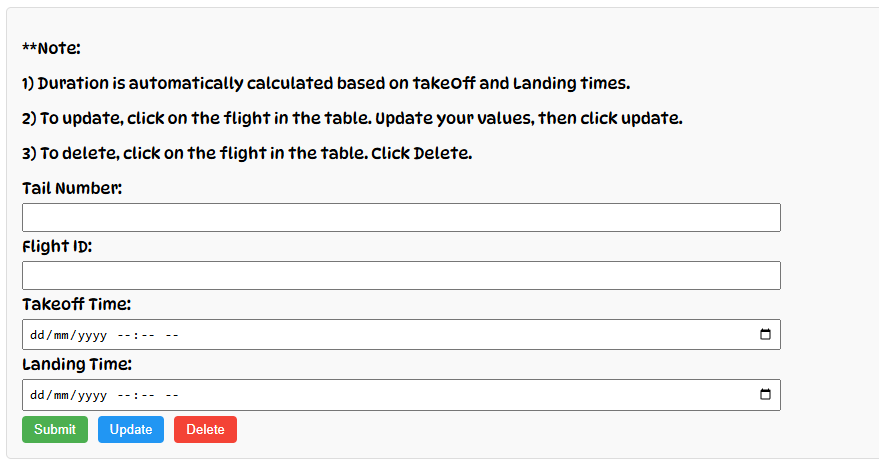
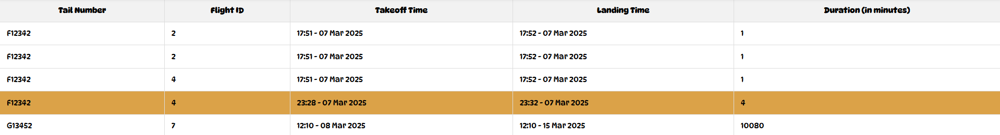
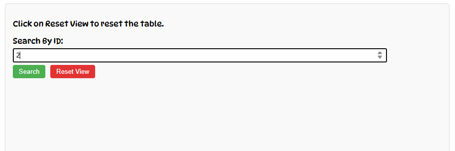
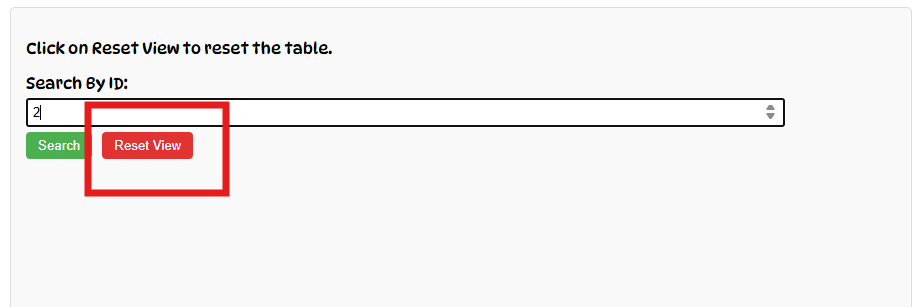
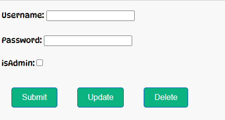
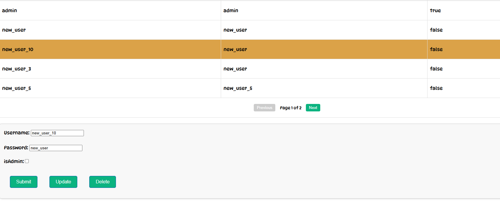

# Flight Management System

## Website

[Flight Management System](https://flight-management-3f213.web.app)

## Features

### Login Page

- Enter any username and password registered in the system.

---

### Flights Page

- **Note:** Flight duration is automatically calculated based on takeoff and landing times. There is no manual input for duration.

## Logout

1. Click the **Logout** button in the top-right corner.

## Add Flight

1. Enter the required details in the form below.
   
2. Click **Submit**.

## Update Flight

1. Select a flight row from the table.
   
2. Modify the necessary details.
3. Click **Update**.

## Delete Flight

1. Select a flight row from the table.
   
2. Click **Delete**.

## Search Flight

1. Enter a **Flight ID** into the search field.
   
2. Click **Search**.
3. To reset the view and display all flights, click **Reset View**.
   

---

### User Management

## Add User

1. Enter the required details in the form below.
   
2. Click **Submit**.

## Update User

1. Select a user from the table.
   
2. Modify the necessary details.
3. Click **Update**.

## Delete User

1. Select a user from the table.
   
2. Click **Delete**.

---

## Notes

- The system automates flight duration calculations.
- Ensure correct details are entered before submitting changes.

For any issues, contact support.
